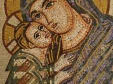
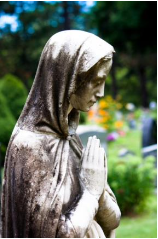

The whole of creation has been groaning in anticipation. We have been waiting for a Messiah—a Savior!—since Adam and Eve, when God declared in the crisp air of Eden that the seed of the woman would strike the head of the serpent. However, this cryptic message was always shrouded in the mists of mystery. Like an intricate riddle embedded in the ancient scrolls of the sacred Torah, foreshadows of the coming "Anointed One" began to echo faintly through the holy writ. The subsonic rumblings began. The underlying theme continued to build throughout the history of the nation of Israel: an almost inaudible whisper in the psalms of the poets, a deafening thunderclap in the shouts of the prophets. God's people waited, indeed, the earth itself waited in eager expectation for the unveiling of the Chosen One.

**What exactly would this Messiah do?** The message was unclear, the signals mixed. Both "Christ" in Greek and "Messiah" in Hebrew designate the anointing of a person. Being smeared with oil upon the forehead was the symbol of the Holy Spirit's power and authority to carry out a specific calling before God. This oil was "fuel for the fire." But what exactly was Messiah called to do? Would he suffer or would he conquer? The contradicting images formed a perplexing puzzle—like this ambiguous account from Isaiah 42:1-2: "Here is my servant, whom I uphold, my chosen one in whom I delight. I will put my Spirit on him and he will bring justice to the nations. He will not shout or cry out or raise his voice in the streets." We wonder: which is it? Would he conquer the nations or remain quietly anonymous?

**Whose child was he?** Born in the City of David yet raised as a refugee in Egypt and the backwoods town of Nazareth. Descended from the royal line of kings, yet not even biologically related to his own "father." Concerns of his illegitimacy trailed him throughout his life as everyone 
wondered to whom he really belonged. This son of mystery would grow into a man for all nations, a universal Savior of the World, yet he remained a child of the Jewish community. Jesus was and is thoroughly Jewish, steeped in the traditions of the Torah, bathed in Hebrew color and culture from infancy to adulthood. We dare not imagine him a tanned European westerner or a sophisticated Greek sophist. This child of wonder was of Abraham's seed; yet his wonder-inflicting words would transcend his ethnicity to encompass the whole world.

The questions multiply: Would he set up a triumphant new regime or suffer utter rejection? Was he the Deliverer of Israel or the Savior of all nations? Was he a Priest—a Son of Adam, who would make atonement for sin, representing humanity before God? Or was he a King—a Son of David, who would sit on the throne forever, representing God before humanity? Or perhaps a Prophet in the tradition of Moses, the Lawgiver—a Son of Man who would call the people back into covenant relationship with their Creator? Some even had the audacity to hint at a cosmic origin before the created order—wishful whispers of the ageless Son of God. With the clock of prophecy counting down and all these conflicting, confusing conclusions at fever pitch, the Messiah was the focal point upon which all the hopes of the oppressed nation of Israel rested. They were sure he was to be their Hero, their Champion, their Liberator. It was in this swirling whirlpool of apocalyptic expectancy that the young virgin Mary has the following visitation:

---
**MEDITATION EXERCISES**

**Preparation:** Calm your mind. Close your eyes, breathe normally and spend a minute or two quietly repeating the phrase in your mind: "Christ in me, the hope of glory..."

**NOTE:** In each meditation exercise, whenever you see a three-dot ellipse (...), that is your cue to do the exercise. Stop reading and take the time to reflect. When you see a question mark (?), pause and ask yourself how you would answer the question.

**Scripture:** Now slowly read through Luke 1:26-56, pausing momentarily upon any word or phrase that stirs you... Open your journal and write down any observations, questions, or other notes Now read through it once more, imagining yourself in the role of Mary. Try to experience it from her first-person perspective...

1. Imagine the immediate reaction of this gentle and innocent young woman in full flower of youth when she first sees the glorious angelic being appear... What do you think was going through her mind? What fears, what questions, what doubts, what wonders? Was she afraid? Was she excited? Was she confused? Was she calm? Was her heart racing in her chest?

2. Ponder each of the jarring declarations of this divine messenger:
   * *"Greetings, you who are highly favored! The Lord is with you."*
   * *"Do not be afraid, Mary, for you have found favor with God."*
   * *"And now you will conceive in your womb and bear a son, and you will name him Jesus."*
   * *"He will be great, and will be called the Son of the Most High, and the Lord God will give to him the throne of his ancestor David."*

Could this have possibly made sense to her understanding—that the Son of the Most High would be conceived within her mortal flesh?

3. Listen to her response of child-like trust: *"Here am I, the servant of the Lord; let it be unto me according to your word..."* How could she so readily embrace this unexpected future of uncertainty, chaos, disgrace, and turmoil? What was her experience of her Celestial Father that she could abandon herself so completely to his divine will?

4. Gaze upon the face of Mary as she opens her glorious song of Magnificat: 

*"My soul magnifies the Lord, and my spirit rejoices in God my Savior, for he has been mindful of the humble state of his servant...* 

What emotions are seen in her eyes? Could you sing these words from the depths of your heart?

**Response:** In your journal, talk to God about any thoughts that surfaced in your heart during this meditation. Are you trying to control everything in your life or will you *let it be unto you according to his word?* What are the travails of soul before you now in your own life? What are some of the unexpected or difficult things that have happened unto you recently? Could you recognize this place of chaos and confusion as a place of advent—where Christ might possibly appear unexpectedly in your life? Does God have your permission (like he really needs it!) to lead you along strange paths, uncomfortable paths, dangerous paths to bring forth his will in your life?